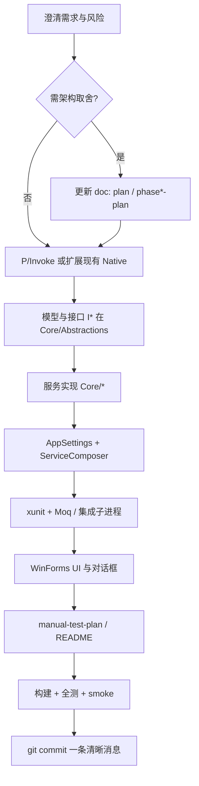

# USB Eject Helper — 后续开发工作流

> 用途：新功能 / 修复 / PR 时按顺序执行，减少返工与安全疏漏。  
> 代码根目录：`UsbEjectHelper/`。主计划见 [`plan.md`](plan.md)；阶段 2 设计见 [`phase2-development-plan.md`](phase2-development-plan.md)。

---

## 1. 总体原则

1. **先设计再动代码**：有风险的行为（结束进程、卷卸载、深度扫描）必须先写或更新设计段落（`doc/phase2-development-plan.md` 或 `plan.md`），再实现。
2. **自底向上实现**：P/Invoke → 纯模型/结果类型 → 服务实现 → 设置与装配 → 单测 → UI → 文档 → 全量验证 → 提交。
3. **默认安全**：危险能力用独立设置项 + **首次开启二次确认**（与 `EnableDeepHandleScan` 同一模式）。
4. **不扩大 diff**：只改任务需要的文件；禁止顺手大重构。
5. **提交前**：`dotnet build` 零警告、`dotnet test` 全绿、必要时 smoke 启动；Windows 上杀残留进程避免文件锁。

---

## 2. 标准工作流（泳道）

---

## 3. 分阶段检查清单（PR10 已验证的顺序）

按下列顺序勾项；可并行仅「文档与测试」在未破坏编译前提下穿插。

| 序号 | 阶段 | 产出 / 要点 |
|:--:|---|---|
| 1 | **需求与文档** | 行为、默认安全策略、二次确认文案、审计/隐私是否要写日志 |
| 2 | **Native** | `NativeMethods.*.cs`：常量、`DllImport`、不与现有重载签名冲突（必要时 `EntryPoint` 别名） |
| 3 | **模型** | `record`/枚举；结果类型含 `Method`/`Reason` 字符串便于 UI 与日志 |
| 4 | **接口** | `Core/Abstractions/I*.cs`；主程序通过接口调用，便于测试 |
| 5 | **服务** | 实现类**不抛**业务异常时优先用返回类型承载失败；日志用 `ILogger` |
| 6 | **设置** | `AppSettings` 新字段 + 默认值偏安全；`SettingsTests` round-trip |
| 7 | **装配** | `ServiceComposer` 注入新服务；保持单一组合根 |
| 8 | **测试** | 单元 + 必要的子进程集成测试；句柄/扫描类测试保持 **xunit 串行**（`xunit.runner.json`） |
| 9 | **UI** | 模态对话框、`InvokeRequired`/`BeginInvoke` 防死锁；并发操作用 `Interlocked` + 禁用按钮 |
| 10 | **手册** | `doc/manual-test-plan.md` 新编号节；`README.md` 配置表/路线图同步 |
| 11 | **验证** | 构建；全测；可选：`Get-Process UsbEjectHelper \| Stop-Process` 后再构建 |
| 12 | **提交** | 一条 commit：`feat(usb-eject): PRn …`；大消息可用 `git commit -F file` |

---

## 4. 与本仓库相关的命令习惯

- **解决方案**：`UsbEjectHelper/UsbEjectHelper.sln`
- **构建**：`dotnet build UsbEjectHelper/UsbEjectHelper.sln -c Debug`
- **测试**：`dotnet test UsbEjectHelper/UsbEjectHelper.sln -c Debug`
- **脚本**：仓库根目录 `run.ps1` / `run.bat`（若存在）与文档保持一致

---

## 5. 功能分类与默认闸门（阶段 2 起）

| 能力 | 典型闸门 / UX |
|---|-----|
| 深度句柄扫描 | `EnableDeepHandleScan` + 首次确认 |
| 程序内结束进程 | `AllowProcessTermination` + 首次确认 |
| 强制 `TerminateProcess` | `EnableForceTerminate` + 每进程确认对话框 |
| 强制弹出卷 | `EnableForceEject` + 首次确认 + **2s 倒计时**确认框 |
| 危险 IOCTL | 仅对 `DriveType.Removable` 等明确条件放行 |

关键进程：`ProcessRiskTier.Critical` 一律不可关闭；`High` 强制结束需**打字匹配**进程名（项目约定）。

---

## 6. 审计与隐私

- 风险动作写入 `%LOCALAPPDATA%\UsbEjectHelper/actions.log`（JSON Lines）。
- `EnablePrivacyMode` 下路径字段脱敏；日志写入失败**不得**影响主流程。

---

## 7. PR / 回顾自检

- [ ] 新 API 是否仅对可移动设备 / 合法 PID？
- [ ] 是否所有“一键危险”都有二次确认或倒计时？
- [ ] `AppSettings` 默认值是否安全？
- [ ] 单测是否覆盖拒绝路径（Critical、无效盘符、已退出进程）？
- [ ] 文档：`README` + `manual-test-plan` 是否同步？

---

## 8. 相关文件索引

| 主题 | 路径 |
|---|---|
| 组合根 | `UsbEjectHelper/src/UsbEjectHelper/App/ServiceComposer.cs` |
| 弹出 | `Core/EjectService.cs`、`Native/NativeMethods.CfgMgr32.cs` |
| 扫描 | `Core/HandleScanner.cs`、`IHandleScanner.cs` |
| 进程关闭 | `Core/ProcessTerminator.cs`、`ProcessTerminator.RestartManager.cs` |
| 强制弹出 | `Core/ForceEjectService.cs` |
| 审计日志 | `Core/ActionAuditLog.cs` |
| 主窗口 | `UI/MainWindow.cs` |
| 设置 UI | `UI/SettingsForm.cs` |
| 设置存储 | `Settings/AppSettings.cs` |

将此工作流与 [`SKILL-usb-eject-helper.md`](SKILL-usb-eject-helper.md) 一并提供给 Agent 时，可得到一致的实现顺序与安全默认值。
